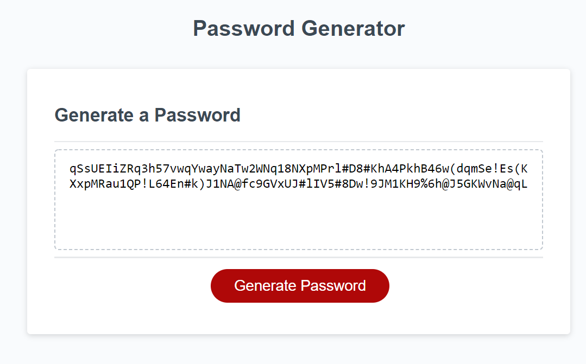

# Random Password Generator

## Live Page Link: https://cobalt88.github.io/random-pass-generator/

this java script web application serves the purpose of generating a random password based on a selection of user inputs and can generate a password anywhere from 8-128 characters. 

The user has the option to choose from upper case letters, lower case letters, special characters, and numbers to be included in the generation algorithm. 

